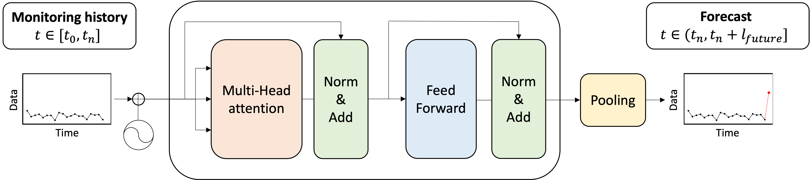

# Deep learning forecasts the spatiotemporal evolution of fluid-induced microearthquakes


*Architecture of the transformer-based MEQ forecasting model.*

**[Blog post about the research](https://communities.springernature.com/posts/deep-learning-forecasts-when-and-where-microearthquakes-do-next-during-fluid-injection)**

## Abstract
Microearthquakes (MEQs) generated by subsurface fluid injection record the evolving stress state and permeability of reservoirs. Forecasting their full spatiotemporal evolution is therefore critical for applications such as enhanced geothermal systems (EGS), CO2 sequestration and other geo-engineering applications. We present a transformer-based deep learning model that ingests hydraulic stimulation history and prior MEQ observations to forecast four key quantities: cumulative MEQ count, cumulative logarithmic seismic moment, and the 50th- and 95th-percentile extents of the MEQ cloud. Applied to the EGS Collab Experiment 1 dataset, the model achieves $R^2 >0.98$ for the 1-second forecast model and $R^2 >0.88$ for the 15-second forecast model across all targets, and supplies uncertainty estimates through a learned standard deviation term. These accurate, uncertainty-quantified forecasts enable real-time inference of fracture propagation and permeability evolution, demonstrating the strong potential of deep-learning approaches to improve seismic-risk assessment and guide mitigation strategies in future fluid-injection operations.


*Schematic of the forecasting procedure.*


*Spatial view of MEQ evolution; each column shows projections on the XY, YZ, and ZX planes.*

## Code usage
To use this code, follow these steps:

1. **Clone the Repository:**
    ```
    git clone https://github.com/jh-chung1/Transformer_MEQ_Forecasting.git
    ```
    
2. **Install Dependencies:**
    ```
    conda env create -f environment.yml
    conda activate meq-transformer
    ```
    
3. **Train the Model:**
    ```
    python train.py \
      --data_dir ./data/ --out_dir ./results/ --n_start 100 --n_future 5 \
      --normalize_local --num_heads 4 --ff_dim 32 --dropout_rate 0.3 \
      --beta 10 --lamda 0.1 --epochs 100 --batch_size 16 --model_out ./results/best_model.h5
    ```

## Dataset
[EGS Collab experiment 1 stimulation data](https://gdr.openei.org/submissions/1229)

[EGS Collab experiment 1 microseismic monitoring data](https://gdr.openei.org/submissions/1166)

## Citation
If you use this work or code in your research, please consider citing our [paper](https://www.nature.com/articles/s43247-025-02644-z):

    @article{chung2025deep,
      title={Deep learning forecasts the spatiotemporal evolution of fluid-induced microearthquakes},
      author={Chung, Jaehong and Manga, Michael and Kneafsey, Timothy and Mukerji, Tapan and Hu, Mengsu},
      journal={Communications Earth \& Environment},
      volume={6},
      number={1},
      pages={643},
      year={2025},
      publisher={Nature Publishing Group UK London}
    }
